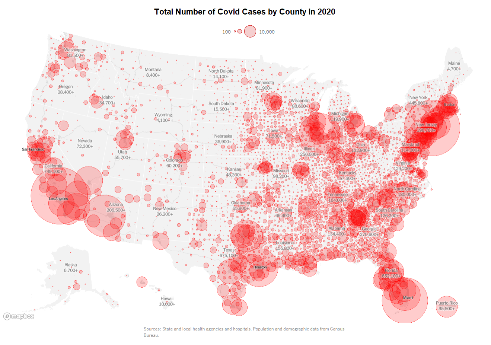

# US COVID-19 Cases Map (2020)

An interactive visualization of COVID-19 cases across US counties in 2020 using Python and Folium.



## Features

- Interactive map showing COVID-19 cases by county
- Circle size indicates number of cases
- Hover over counties to see details
- Shows both total cases and deaths
- Includes state boundaries
- Excludes Alaska and Hawaii for better continental US visualization

## Requirements

- Python 3.12+
- Required packages listed in `requirements.txt`

## Setup

1. Clone the repository:
```bash
git clone https://github.com/YOUR_USERNAME/us-covid-map-2020.git
cd us-covid-map-2020
```

2. Create and activate a virtual environment:
```bash
python -m venv venv
source venv/bin/activate  # On Windows: venv\Scripts\activate
```

3. Install dependencies:
```bash
pip install -r requirements.txt
```

4. Download the COVID-19 data:
- Get the `us-counties.csv` file containing COVID-19 case data
- Place it in the project root directory

5. Run the script:
```bash
python create_covid_map.py
```

6. Open `covid_map.html` in your web browser to view the map

## Data Sources

- COVID-19 case data: us-counties.csv
- County boundaries: GeoJSON from Plotly datasets
- State boundaries: Folium example data

## License

MIT License - feel free to use and modify as needed. 